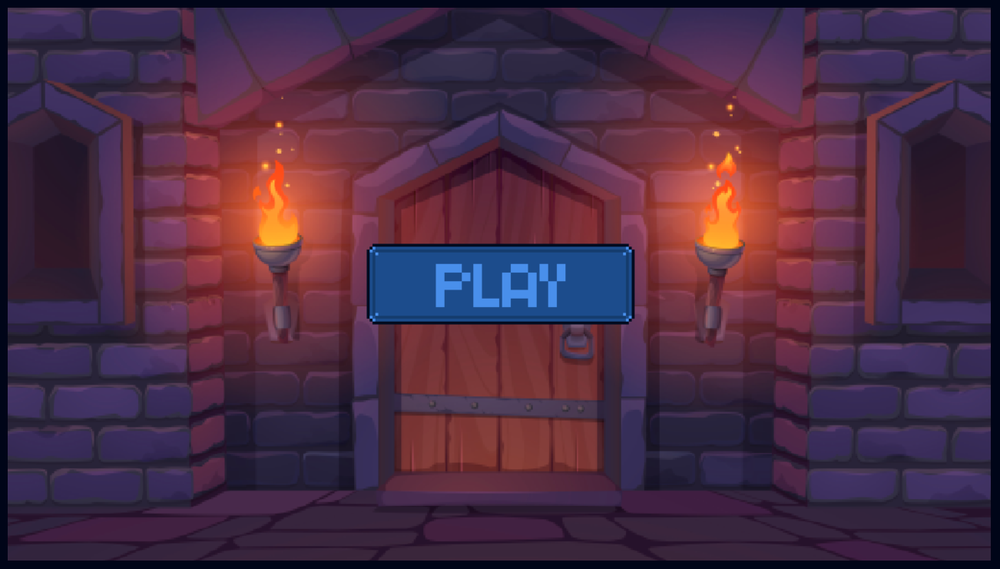
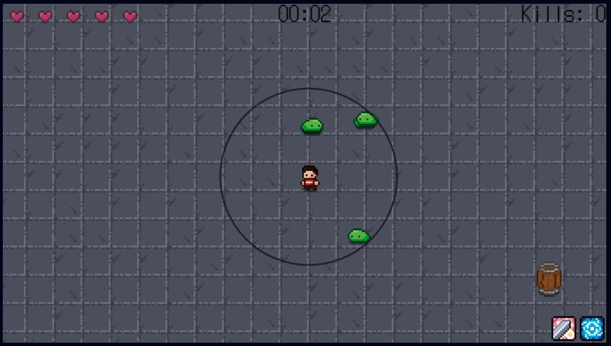
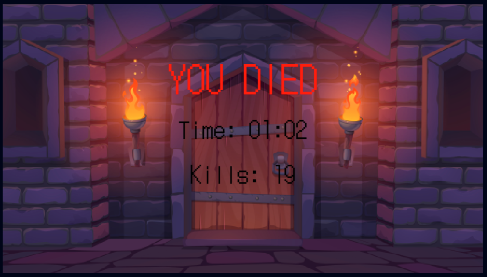

# Web Tabanlı Programlama Oyun Projesi

### [Oyunun Linki](https://erengureli.github.io/web-tabanli-programlama-oyun-projesi/)
### [Videonun Linki](https://www.youtube.com/watch?v=Lb-xQWFjEWU)

## Oynanış
- **W A S D** ile haraket ettiriliyor.
- **Fare Sol Tuşu** ile alan hasarı veren normal saldırı yapıyor.
  - **Bekleme Süresi:** 0.5 Saniye
  - **Sersemletme Süresi:** 0.25 Saniye
- **E Tuşu** ile zaman durdurma yeteneğini kullanıyor.
  - **Bekleme Süresi:** 5 Saniye
  - **Sersemletme Süresi:** 4 Saniye

## Oyunun Amacı
En uzun süre hayatta kalıp en fazla canavarı öldürmek.

## Oyun İçi Görüntüler

## Kullandığım Asset'ler
- [Map, Karakterler ve Animasyonları](https://melthie.itch.io/mini-dungeon)
- [Kalpler](https://snoblin.itch.io/pixel-hearts)
- [Fare İmleci](https://megabyte-games.itch.io/mouse-cursor-pack)
- [Attack ve Skill Cooldown Resimleri](https://pixerelia.itch.io/vas-basic-spells-and-buffs)
- [Butonlar](https://kkmiyu.itch.io/pixel-contourned)
